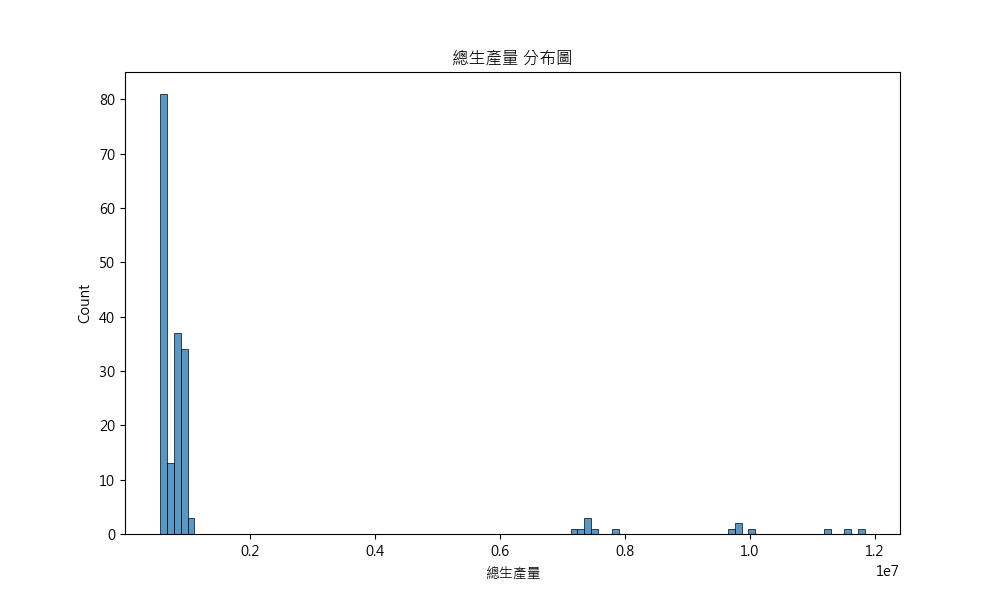
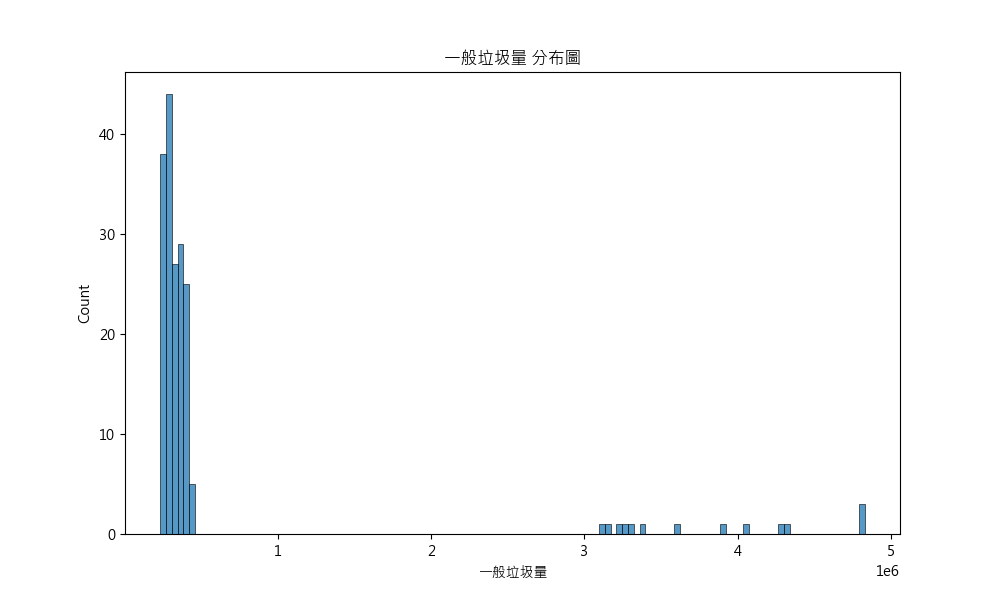
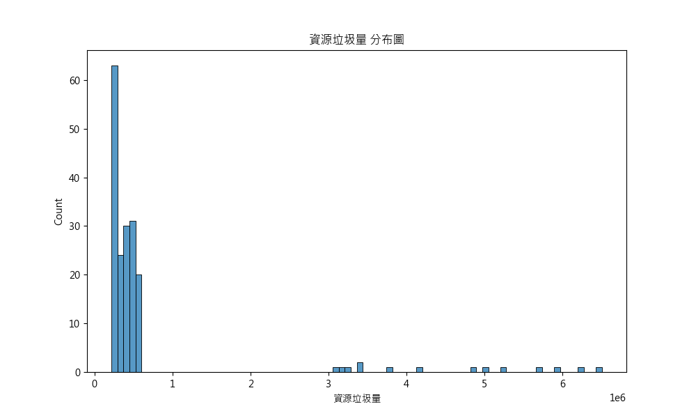
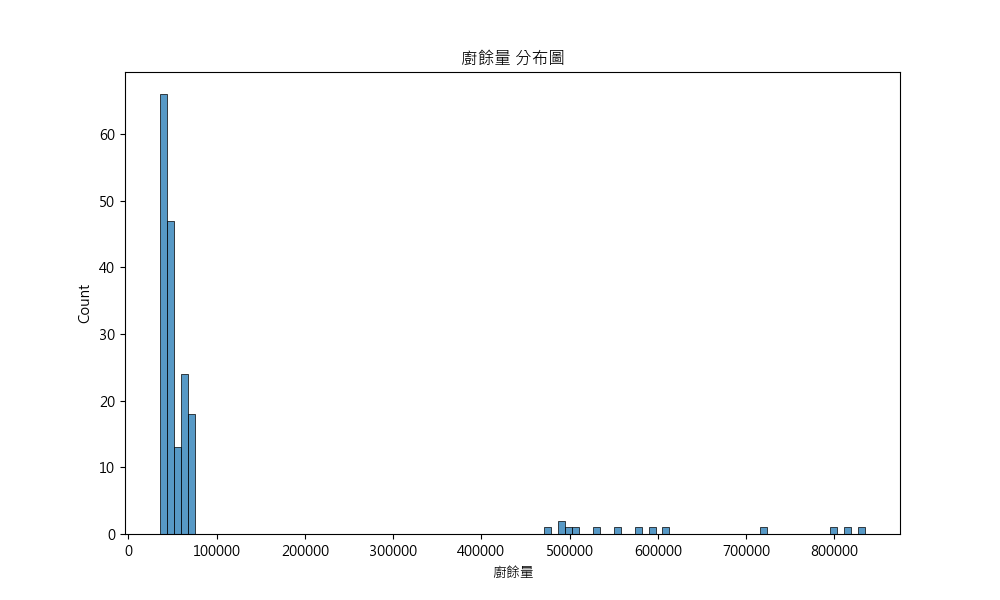
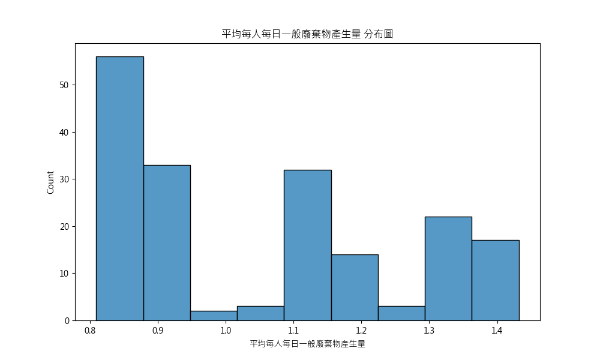
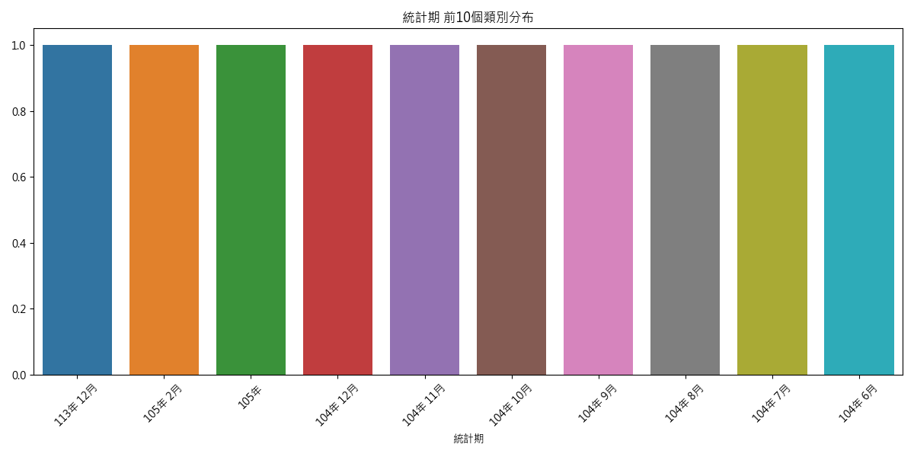

# 資料分析報告

## 資料概覽
- 資料筆數：182
- 欄位數量：6
- 欄位名稱：統計期, 總生產量, 一般垃圾量, 資源垃圾量, 廚餘量, 平均每人每日一般廢棄物產生量

## 數值型欄位統計
|       |             總生產量 |            一般垃圾量 |            資源垃圾量 |      廚餘量 |   平均每人每日一般廢棄物產生量 |
|:------|-----------------:|-----------------:|-----------------:|---------:|-----------------:|
| count |    182           |    182           |    182           |    182   |       182        |
| mean  |      1.38849e+06 | 594327           | 700962           |  93196.7 |         1.05464  |
| std   |      2.26384e+06 | 963879           |      1.16847e+06 | 152742   |         0.200025 |
| min   | 569058           | 233790           | 218724           |  36139   |         0.809    |
| 25%   | 621134           | 275344           | 281160           |  42271   |         0.86825  |
| 50%   | 779216           | 324674           | 387898           |  47542   |         1.021    |
| 75%   | 933898           | 382269           | 500034           |  64689.5 |         1.1905   |
| max   |      1.184e+07   |      4.82811e+06 |      6.50655e+06 | 834541   |         1.432    |

## 類別型欄位統計
### 統計期
| 統計期      |   count |
|:---------|--------:|
| 113年 12月 |       1 |
| 105年 2月  |       1 |
| 105年     |       1 |
| 104年 12月 |       1 |
| 104年 11月 |       1 |
| 104年 10月 |       1 |
| 104年 9月  |       1 |
| 104年 8月  |       1 |
| 104年 7月  |       1 |
| 104年 6月  |       1 |

## 視覺化圖表
### 總生產量 分布圖

### 一般垃圾量 分布圖

### 資源垃圾量 分布圖

### 廚餘量 分布圖

### 平均每人每日一般廢棄物產生量 分布圖

### 統計期 前10個類別分布

